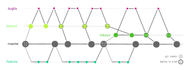

# vN

vN is a a dead-simple git branching and artifact versioning model for
continuously deployed services and data pipelines.

vN is similar to
[gitflow](https://nvie.com/posts/a-successful-git-branching-model/) and
[oneflow](https://www.endoflineblog.com/oneflow-a-git-branching-model-and-workflow).
While those models are quite complex, most of the complexity comes from having
to maintain multiple different versions of a repo in production, as is common
when one distributes software. In continuously deployed services, however, the
requirements are different, and vN uses these to significantly simplify the git
workflow.

* [In a Nutshell](#in-a-nutshell)
* [Rules](#rules)
  * [The Big Assumption](#the-big-assumption)
  * [Releases](#releases)
  * [Branches](#branches)
  * [HotFix Workflow](#hotfix-workflow)
  * [Stable Artifact Versioning with RC ids](#stable-artifact-versioning-with-rc-ids)
* [CLI Tools](#cli-tools): `vN-rc-id` and `vN-changelog`
* [Discussion](#discussion)
  * [Semantic Versioning](#semantic-versioning)
  * [Motivation](#motivation)
  * [Comparison with Other Models](#comparison-with-other-models)

## In a Nutshell

In vN, unlike SemVer-inspired models, versions are linearly ordered: v1, v2, ...
Its git branching workflow for development, deployment, and hotfixes imposes no
extra overhead. Most importantly, [RC IDs](#stable-artifact-versioning-with-rc-ids)
provide a stable way to version artifacts in a way that decouples CI/CD
pipeline lifecycle from creation of git tags.

The diagram below describes the [rules](#rules) of vN. This repository itself
has followed these rules.

<p align="center">  </p>

## Rules

### The Big Assumption

The linear versioning scheme of vN only makes sense if there is only
one version in production most of the time. If you have this nice, strong
constraint, then vN is for you.

Even if you have multiple instances of the same _version_ deployed in
production (eg separate deployment for separate customers), vN will continue to
work. But if you need to maintain multiple versions of your system in
production, vN will probably not help you.

### Releases

Versions, aka git tags, have the form `vN`, ie v1, v2, ...

This is a crucial assumption in vN. Without it (eg if you use SimVer) the
[RC id](#stable-artifact-versioning-with-rc-ids) trick collapses.


The act of releasing consists of:

* execute deploy pipeline
* (optional) verify successful deploy
* create git tag at deployed commit

In vN **every commit is a release candidate**. There are no restrictions based on branch
names or tags. The recommended workflow is to always deploy from main except
for the [hotfix workflow](#hotfix-workflow).

### Branches

There is __one eternal branch__, the active branch (main/master).

And unlike gitflow or oneflow, there is only one other kind of branch: those that
branch off of main and merge back into it. Features and bug fixes, include
hotfixes to production, all follow the usual standard workflow:

1. branch off of main branch,
2. commit and push, review, and repeat,
3. merge back into main branch.

The recommended workflow is to deploy from commits in the main branch,
preferably but not necessarily the branch tip, with the exception of
[hotfixes](#hotfix-workflow).

vN generally doesn't care whether you use fast-forward merges or not.

### Hotfix Workflow

All git branching models have a special workflow for the (hopefully unlikely)
event that two unfortunate events have happened:
1. you need to urgently deploy a patch to production
2. the main branch is not deployable.

In vN the hotfix workflow is identical to the usual workflow except for this.
You initiate the release from a commit that is not yet in the main branch, on a
temporary bug fix branch that will eventually be merged back into main _after_
it's released. This is different from the normal workflow where deploys are
initiated from the main branch.

If you've worked with other more complex hotfix workflows, you'll hopefully find
this simplicity a breath of fresh air.

### Stable Artifact Versioning with RC IDs

This is where vN's simplicity allows you to solve a whole host of problems that
gitflow and other similar SemVer-inspired models struggle with.

#### What's the Problem?

A typical medium/large CI/CD pipeline is multi-stage, with various data
artifacts produced in upstream steps and consumed in downstream steps.

These artifacts could be docker images, disk snapshots, S3 buckets, or even
deployed instances of a service, all of which needs to be labeled by the CI/CD
pipeline so that we can tell which artifact belongs to which version in the
future.

Now, let's say we're about to deploy the next version, say v9. Here's how things
could go wrong if we naively retrofit SemVer tools like gitflow:

* You'd want your artifacts to refer to the new version v9. Maybe something
  like `v9-abcdef12` where the second token is the git commit SHA.
* For this to work, your CI/CD pipeline should begin after you have created the
  git tag.
* What happens if something breaks throughout the many stages of CI/CD?  You
  can either delete the tag or consider that tag garbage, both undesirable.
* And if you decide to tag your git commit _after_ a successful deployment,
  you'd have to repeat the entire CI/CD pipeline twice: once for staging with a
  special non-final tag (eg `v9-rc1-abcdef12`), and another time with the final
  version (eg `v9-abcdef12`). This makes the already non-trivial branch/merge
  dance for releases even more unpleasant.

#### RC IDs

Here's how vN solves these problems:

* Every commit is a release candidate (RC).
* Every commit gets an RC ID that's "stable" in the sense that you know
  the one and only RC id of your commit as soon as the commit exists, regardless
  of when, whether, and how it's eventually tagged in git.

| git version †   | RC ID               | Notes                                 |
|-----------------|---------------------|---------------------------------------|
|`v4-9-g34cff88a` |`v5-rc-34cff88a`     | RC IDs look ahead.<br>They refer to the next release<br>that each commit could become.  |
|`v5-0-g34cff88a` |`v5-rc-34cff88a`     | When we eventually<br>tag a deployed commit, its RC ID<br> is unchanged. |
|`v5-4-gf88a34cf` |`v6-rc-f88a34cf`     | And on we go to the<br> next release |

† as per [git describe](https://www.git-scm.com/docs/git-describe)

The power of RC ids is that they allow you to decouple the lifecycle of git tags
from the CI/CD pipeline, while preserving meaningful and unique artifact labels.

## CLI Tools

### RC-ID Generation

The `vN-rc-id` command produces RC ids as described in the previous section:
```
$ vN-rc-id
v5-rc-f3ea842
```
As promised in the previous section, RC ids remain unchanged throughout the
lifecycle of your deploy pipeline, regardless of when and how you tag the
deployed commit with the next version tag.

### Automatic Changelogs

If you do _not_ use fast-forward merges as part of your review/merge workflow,
the `vN-changelog` command helps your produce a changelog from your merge commits:
```
$ vN-changelog v2..v4
- [643ab5e7] 2021-11-22: Merge branch 'feature/4' into main
- [2eeb54d2] 2021-11-21: Merge branch 'feature/5' into main
- [f18ccf33] 2021-11-19: Merge branch 'feature/2' into main
- [7bd0fbec] 2021-11-18: Merge branch 'feature/3' into main
```

This is the only place where `vN` cares about your merge strategy. It interprets
merge commits as high-level events in the repository (eg a PR is merged) that
together form the changelog. If you like fast-forward merges, all you lose is
the changelog tool, the rest of vN will work for you.

Some tools (eg [GitLab]) allow you to configure your merge commit message. You
could use this to populate your merge commits with information you can then
parse using vN's tooling to produce better automatic changelogs.

[GitLab]: https://docs.gitlab.com/ee/user/project/merge_requests/commit_templates.html

## Discussion

## Semantic Versioning

Before arriving at the design of vN, I experimented with the following model
that allows semantic versioning. For simplicity it only includes major and minor
versions (no patch versions) but the structure would be the same to support the
full SemVer scheme.

It still assumes that you only  care about maintaining a single version in
production at a given moment. But the nonlinear versioning scheme allows
communicating breaking/non-breaking changes to users. For example, presumably,
there are no breaking changes v2.0 and v2.1 but there might be some between v2.1
and v3.0.

This arrangement is more complex than vN, and will cost you the ability to have
stable RC ids. But it's still simpler than gitflow and oneflow for continuously
deployed services.

<p align="center">  </p>

## Motivation

We like a process that encourages good behavior by making good behavior really easy.
Specifically, you probably want to:

* commit early and push often,
* code review of all new development (features or bug fixes),
* nothing rolled out to production without tests and QA in a staging environment,
* short release cycles, possibly to the point of continuous deployments,
* easy application of urgent bug fixes to production.

This translates to these goals for a git branching/versioning:

* temporary branches for day-to-day feature development and bug fixes.
* multi-stage CI/CD pipelines that forces staging before production deployments,
  instead of leaving it as an optional, manual process.
* a release workflow that's so easy and fast that you can afford many of them a week.
* a hotfix workflow that's no more complex than the default workflow.

### Comparison with Other Models

There are three scenarios that all git branching models (this one included) want
to deal with:

* normal course of development,
* releases,
* maintenance between releases (hotfixes).

#### Normal course of development

There is no debate here among different branching models over this:

* All development happens on __temporary branches__ dedicated to the task,
* There is a designated __long-living active branch__ (be it develop or master) where
  all said temporary branches branch from and merge into.

#### Releases

All models also agree on roughly what a release looks like:

1. you pick a deployable commit, that's your release candidate.
1. you somehow trigger a CI/CD pipeline for that commit
1. at some point, you update your git repo (tags, branches), to indicate a
   successfully deployed commit in git history.

Seems reasonable. But here are a few questions a git branching and versioning
model has to answer:

* How is the fact that a commit is a release candidate represented in git?
* What happens to a commit after it's successfully deployed?
* What if deploy fails?
* Does the act of deploying impose a freeze window on the git repo?
* If there are bugs that are fixed throughout deployment and QA, how are they
  brought back into the main branch so that subsequent releases also include
  them?
* What happens if you need to ship a patch to production? How does that interact
  with the state of the main branch? What if this happens in the middle of the
  next release deploy?

#### Long-living branches and hotfixes

A big source of complexity in any git branching model is the number and the
relationships between different branches. The sweet spot for almost every one I
know is to use branches often and to merge them into a target branch regularly.
The cognitive burden kicks in when you have multiple long-living branches that
do not eventually, or frequently, merge into a target branch and dissolve.

For example, in gitflow:
* there are two long-living branches (__master__ and __develop__)
* release, feature, and bugfix branches are temporary.
* normal feature branches start from and merge back into the active branch
  develop.
* release branches start from the active branch, get polished and tested, and
  merge into master, the "prod" branch.
* it is in the prod branch master that final released versions get tagged,
  e.g. v1.0.
* bugfix branches start from the prod branch master, and merge back into prod
  _and_ separately into the active branch develop.

Oneflow recognizes the cognitive burden of having to deal
with two long-living branches and the added history complexity of all these
inter-branch logic. Instead, in oneflow:
* there is only __one long-living branch__, the active branch master.
* feature branches start from and merge back into the active branch master.
* release branches start from and merge back into the active branch master.
* it is on the release branch that final released versions get tagged, e.g.
  v1.0.
* once a release is rolled out, the release branch is defunct.
* all hotfixes are dealt with on ad-hoc temporary branches, which is where patch
  releases, e.g. v1.1, are tagged.
* hotfix branches are merge directly back into the active branch master.

The approach of vN is that long living branches are too complex and make
everything around them more complex. For this reason, both vN and the
semver-capable modification described above only have one long living branch
that captures all the important events in the history of the repo.
